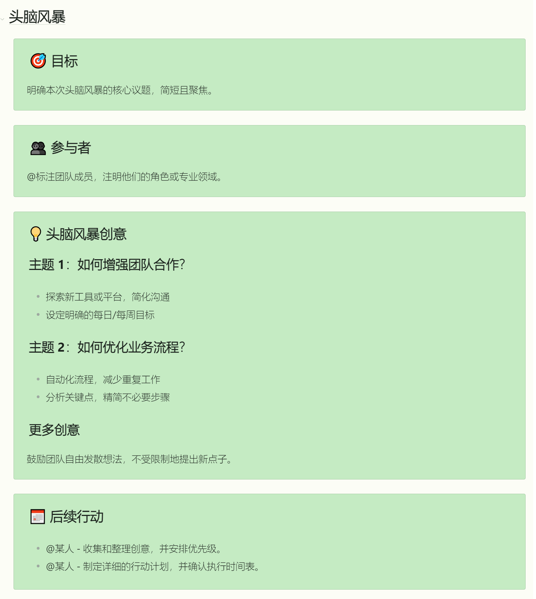

## 示例：

    <h2>🎯 目标</h2>
    
明确本次头脑风暴的核心议题，简短且聚焦。

 

    <h2>👥 参与者</h2>
    
@标注团队成员，注明他们的角色或专业领域。

 

    <h2>💡 头脑风暴创意</h2>
    <h3>主题 1：如何增强团队合作？</h3>
    <ul>
        <li>探索新工具或平台，简化沟通</li>
        <li>设定明确的每日/每周目标</li>
    </ul>
    <h3>主题 2：如何优化业务流程？</h3>
    <ul>
        <li>自动化流程，减少重复工作</li>
        <li>分析关键点，精简不必要步骤</li>
    </ul>
    <h3>更多创意</h3>
    
鼓励团队自由发散想法，不受限制地提出新点子。

 

    <h2>📅 后续行动</h2>
    <ul>
        <li>@某人 - 收集和整理创意，并安排优先级。</li>
        <li>@某人 - 制定详细的行动计划，并确认执行时间表。</li>
    </ul>

