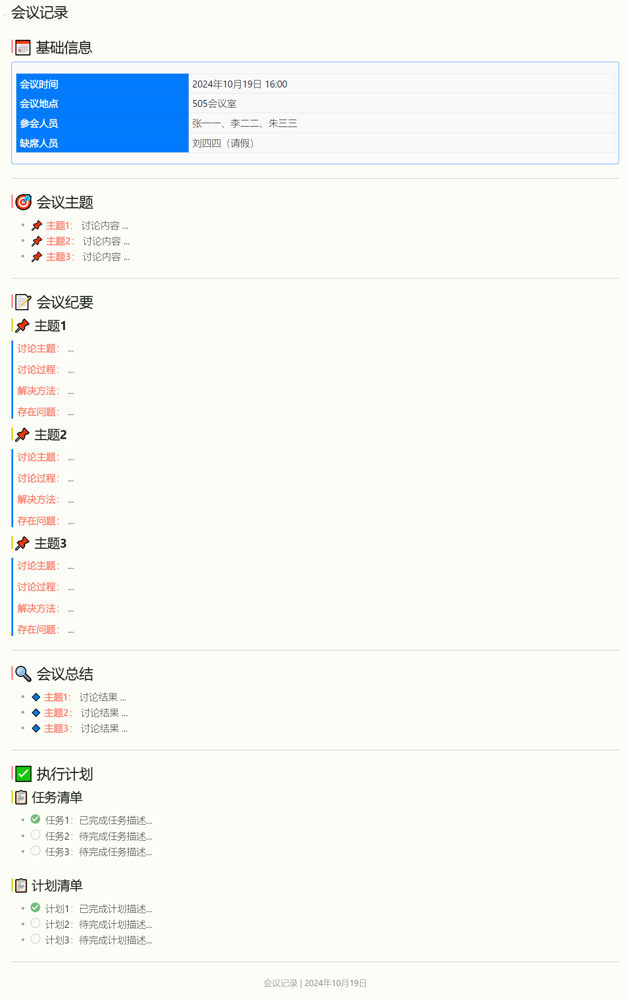

## 示例：

# 📅 基础信息

<table style="width:100%; border-collapse: collapse;">
  <tr>
    <th style="background-color: #007bff; color: white; padding: 8px;">会议时间</th>
    <td style="padding: 8px; border: 1px solid #ddd;">2024年10月19日 16:00</td>
  </tr>
  <tr>
    <th style="background-color: #007bff; color: white; padding: 8px;">会议地点</th>
    <td style="padding: 8px; border: 1px solid #ddd;">505会议室</td>
  </tr>
  <tr>
    <th style="background-color: #007bff; color: white; padding: 8px;">参会人员</th>
    <td style="padding: 8px; border: 1px solid #ddd;">张一一、李二二、朱三三</td>
  </tr>
  <tr>
    <th style="background-color: #007bff; color: white; padding: 8px;">缺席人员</th>
    <td style="padding: 8px; border: 1px solid #ddd;">刘四四（请假）</td>
  </tr>
</table>

---

# 🎯 会议主题
<ul>
  <li>📌 <strong>主题1：</strong> 讨论内容 ...</li>
  <li>📌 <strong>主题2：</strong> 讨论内容 ...</li>
  <li>📌 <strong>主题3：</strong> 讨论内容 ...</li>
</ul>

---

# 📝 会议纪要

### 📌 主题1

  
<strong>讨论主题：</strong> ...

  
<strong>讨论过程：</strong> ...

  
<strong>解决方法：</strong> ...

  
<strong>存在问题：</strong> ...

### 📌 主题2

  
<strong>讨论主题：</strong> ...

  
<strong>讨论过程：</strong> ...

  
<strong>解决方法：</strong> ...

  
<strong>存在问题：</strong> ...

### 📌 主题3

  
<strong>讨论主题：</strong> ...

  
<strong>讨论过程：</strong> ...

  
<strong>解决方法：</strong> ...

  
<strong>存在问题：</strong> ...

---

# 🔍 会议总结
<ul>
  <li>🔹 <strong>主题1：</strong> 讨论结果 ...</li>
  <li>🔹 <strong>主题2：</strong> 讨论结果 ...</li>
  <li>🔹 <strong>主题3：</strong> 讨论结果 ...</li>
</ul>

---

# ✅ 执行计划

### 📋 任务清单
<ul style="list-style-type: none;">
  <li><input type="checkbox" checked> 任务1：已完成任务描述...</li>
  <li><input type="checkbox"> 任务2：待完成任务描述...</li>
  <li><input type="checkbox"> 任务3：待完成任务描述...</li>
</ul>

### 📋 计划清单
<ul style="list-style-type: none;">
  <li><input type="checkbox" checked> 计划1：已完成计划描述...</li>
  <li><input type="checkbox"> 计划2：待完成计划描述...</li>
  <li><input type="checkbox"> 计划3：待完成计划描述...</li>
</ul>

---

会议记录 | 2024年10月19日

