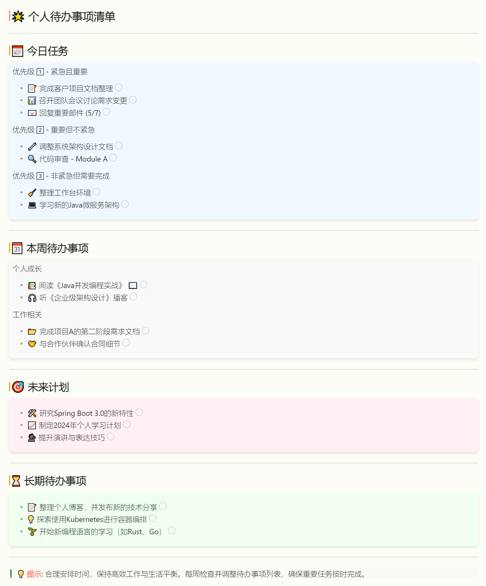

示例：

# 🌟 个人待办事项清单

---

## 📅 今日任务

优先级 1️⃣ - 紧急且重要
<ul style="list-style-type:none;">
    <li>📝 完成客户项目文档整理 <input type="checkbox"></li>
    <li>📊 召开团队会议讨论需求变更 <input type="checkbox"></li>
    <li>📧 回复重要邮件 (5/7) <input type="checkbox"></li>
</ul>
优先级 2️⃣ - 重要但不紧急
<ul style="list-style-type:none;">
    <li>🔧 调整系统架构设计文档 <input type="checkbox"></li>
    <li>🔍 代码审查 - Module A <input type="checkbox"></li>
</ul>
优先级 3️⃣ - 非紧急但需要完成
<ul style="list-style-type:none;">
    <li>🧹 整理工作台环境 <input type="checkbox"></li>
    <li>💻 学习新的Java微服务架构 <input type="checkbox"></li>
</ul>

---

## 🗓 本周待办事项

个人成长
<ul style="list-style-type:none;">
    <li>📚 阅读《Java并发编程实战》 📖 <input type="checkbox"></li>
    <li>🎧 听《企业级架构设计》播客 <input type="checkbox"></li>
</ul>
工作相关
<ul style="list-style-type:none;">
    <li>📂 完成项目A的第二阶段需求文档 <input type="checkbox"></li>
    <li>🤝 与合作伙伴确认合同细节 <input type="checkbox"></li>
</ul>

---

## 🎯 未来计划

<ul style="list-style-type:none;">
    <li>🛠 研究Spring Boot 3.0的新特性 <input type="checkbox"></li>
    <li>📈 制定2024年个人学习计划 <input type="checkbox"></li>
    <li>🗣 提升演讲与表达技巧 <input type="checkbox"></li>
</ul>

---

## ⏳ 长期待办事项

<ul style="list-style-type:none;">
    <li>📝 整理个人博客，并发布新的技术分享 <input type="checkbox"></li>
    <li>💡 探索使用Kubernetes进行容器编排 <input type="checkbox"></li>
    <li>🌱 开始新编程语言的学习（如Rust、Go） <input type="checkbox"></li>
</ul>

---

> **💡 提示**: 合理安排时间，保持高效工作与生活平衡。每周检查并调整待办事项列表，确保重要任务按时完成。