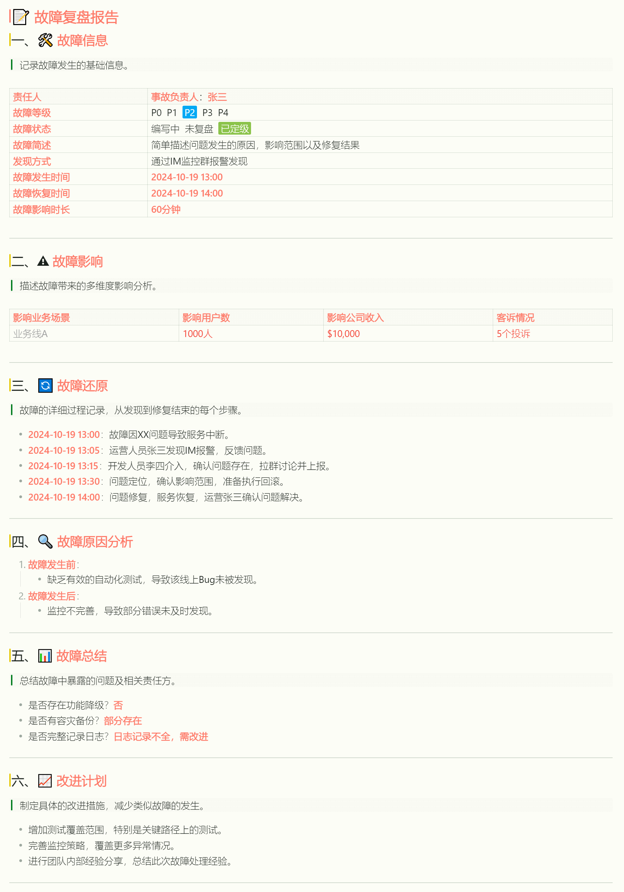

## 示例：

# 📝 **故障复盘报告**

### 一、🛠️ **故障信息**

> 记录故障发生的基础信息。

| **责任人**     | **事故负责人**：**张三**                       |
| -------------- | ---------------------------------------------- |
| **故障等级**   | P0&nbsp;&nbsp;P1&nbsp;&nbsp;P2&nbsp;&nbsp;P3&nbsp;&nbsp;P4 |
| **故障状态**   | 编写中&nbsp;&nbsp;未复盘&nbsp;&nbsp;已定级 |
| **故障简述**   | 简单描述问题发生的原因，影响范围以及修复结果 |
| **发现方式**   | 通过IM监控群报警发现 |
| **故障发生时间** | **2024-10-19 13:00**                              |
| **故障恢复时间** | **2024-10-19 14:00**                              |
| **故障影响时长** | **60分钟**                                        |

---

### 二、⚠️ **故障影响**

> 描述故障带来的多维度影响分析。

| **影响业务场景**          | **影响用户数**         | **影响公司收入**        | **客诉情况**           |
| ------------------------- | ---------------------- | ----------------------- | ---------------------- |
| 业务线A  | 1000人  | $10,000 | 5个投诉 |

---

### 三、🔄 **故障还原**

> 故障的详细过程记录，从发现到修复结束的每个步骤。

- **2024-10-19 13:00**：故障因XX问题导致服务中断。
- **2024-10-19 13:05**：运营人员张三发现IM报警，反馈问题。
- **2024-10-19 13:15**：开发人员李四介入，确认问题存在，拉群讨论并上报。
- **2024-10-19 13:30**：问题定位，确认影响范围，准备执行回滚。
- **2024-10-19 14:00**：问题修复，服务恢复，运营张三确认问题解决。

---

### 四、🔍 **故障原因分析**

1. **故障发生前**：
   - 缺乏有效的自动化测试，导致该线上Bug未被发现。
2. **故障发生后**：
   - 监控不完善，导致部分错误未及时发现。

---

### 五、📊 **故障总结**

> 总结故障中暴露的问题及相关责任方。

- 是否存在功能降级？**否**
- 是否有容灾备份？**部分存在**
- 是否完整记录日志？**日志记录不全，需改进**

---

### 六、📈 **改进计划**

> 制定具体的改进措施，减少类似故障的发生。

- 增加测试覆盖范围，特别是关键路径上的测试。
- 完善监控策略，覆盖更多异常情况。
- 进行团队内部经验分享，总结此次故障处理经验。

---